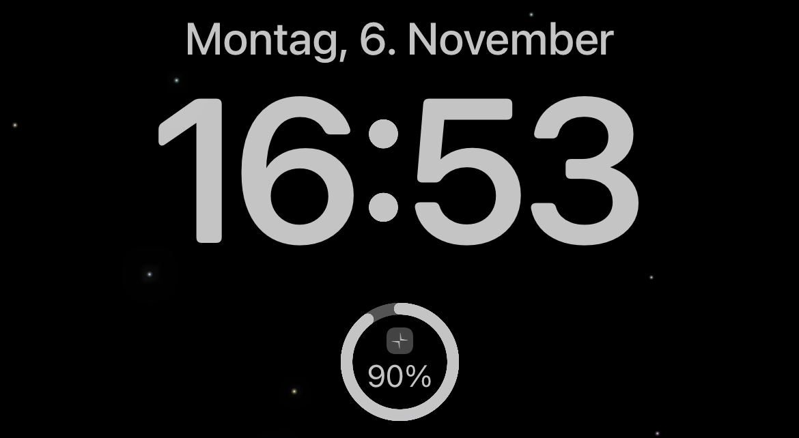

# Polestar SoC iOS Lockscreen Widget

An iOS lockscreen widget to display the current state of charge (SoC) of your Polestar 2.



## Background

Since the official Polestar App does not support any kind of widgets for iOS, I developed my own with the help of [Scriptable](https://scriptable.app/). Without an official public Polestar API being released yet, the widget relies on the [Tibber GraphQL API](https://developer.tibber.com/docs/overview) as proxy to get the current state of charge of the battery. Thus, you will also need Tibber Account to get access to the SoC data.

## Prerequisites

1. Free Tibber Account with configured Polestar Power-Up
    > :warning: You **don't** need an electricity contract, you can just proceed with the free account.
    - Install [Tibber App](https://apps.apple.com/de/app/tibber-%C3%B6kostrom/id1127805969) on your iPhone and follow the registration instructions. Make sure to remember the email & password used to create the Tibber account.
    - [Configure Polestar Power-Up](https://support.tibber.com/en/articles/6675026-smart-charge-your-polestar-with-tibber#:~:text=How%20do%20I%20connect%20my%20Polestar%20to%20Tibber%3F)
2. Install [Scriptable](https://apps.apple.com/de/app/scriptable/id1405459188) on your iPhone
3. [Optional but recommended] Follow the [ScriptDude installation steps](https://scriptdu.de/#installation)

## Installation

1. Make sure you have followed all mandatory steps described in [Prerequisites](./README.md#Prerequisites).

2. There are two options to install the widget:
    - [Recommended] Click on the following button to install via `ScriptDude` (make sure that you have followed step 3 of [Prerequisites](./README.md#Prerequisites)). ScriptDude will automatically receive updates of new versions of this widget

        [](https://scriptdu.de/?name=Polestar%20Lockscreen%20SoC%20Widget&source=https%3A%2F%2Fgist.githubusercontent.com%2Fniklasvieth%2F9cb306b53835a9a283e34b77f0f2513f%2Fraw%2Ff5e29c99e8cc017c0d4fa2f8e825f79031282a2a%2Fpolestar-lockscreen-widget.js&docs=https%3A%2F%2Fgithub.com%2Fniklasvieth%2Fpolestar-ios-lockscreen-widget%2Fblob%2Fmain%2FREADME.md#generator&color=green&icon=battery-half)
    - Copy the content of [polestar-lockscreen-widget.js](https://gist.github.com/niklasvieth/9cb306b53835a9a283e34b77f0f2513f), create a new script in `Scriptable`, paste the content and rename it to `Polestar Lockscreen SoC Widget`.

3. Replace the placeholder values for `TIBBER_EMAIL` and `TIBBER_PASSWORD` with your Tibber login credentials.

    ```js
    // Config
    const TIBBER_EMAIL = "<EMAIL_ADDRESS>";
    const TIBBER_PASSWORD = "<PASSWORD>";
    ```

4. Add the smallest `Scriptable` widget to your lockscreen. See [Apple How-To guide](https://support.apple.com/en-us/HT207122#:~:text=How%20to%20add%20widgets%20to%20your%20Lock%20Screen).

5. Tab on the widget to configure the widget. Select `Polestar Lockscreen SoC Widget` as script, leave everything else blank and save your lockscreen.

6. You should now be able to see the :battery: SoC of your Polestar on you lockscreen. By clicking on the widget you will be navigated to the Polestar App.

## Additional comments

There might be a minor lag or difference of the SoC compared to value displayed in the Polestar App because of the following reasons:

- The widget is relying on the Tibber API which syncs regularly with the actual Polestar API.
- The refresh interval of the widget is determined by iOS itself.

### Appreciation

- Thanks @simonbs for the awesome [Scriptable](https://scriptable.app/) app.
- Thanks @Sillium for the [ProgressCircleService.js](https://gist.github.com/Sillium/4210779bc2d759b494fa60ba4f464bd8#file-progresscircleservice-js) which I am reusing.
