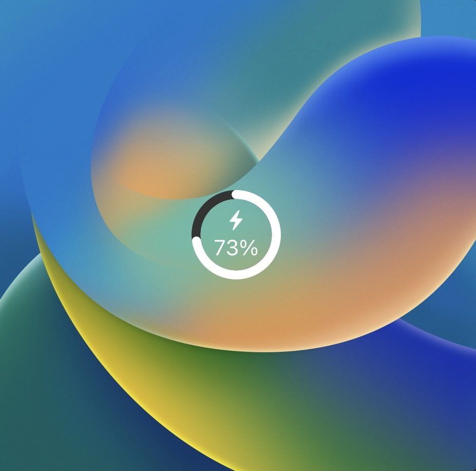
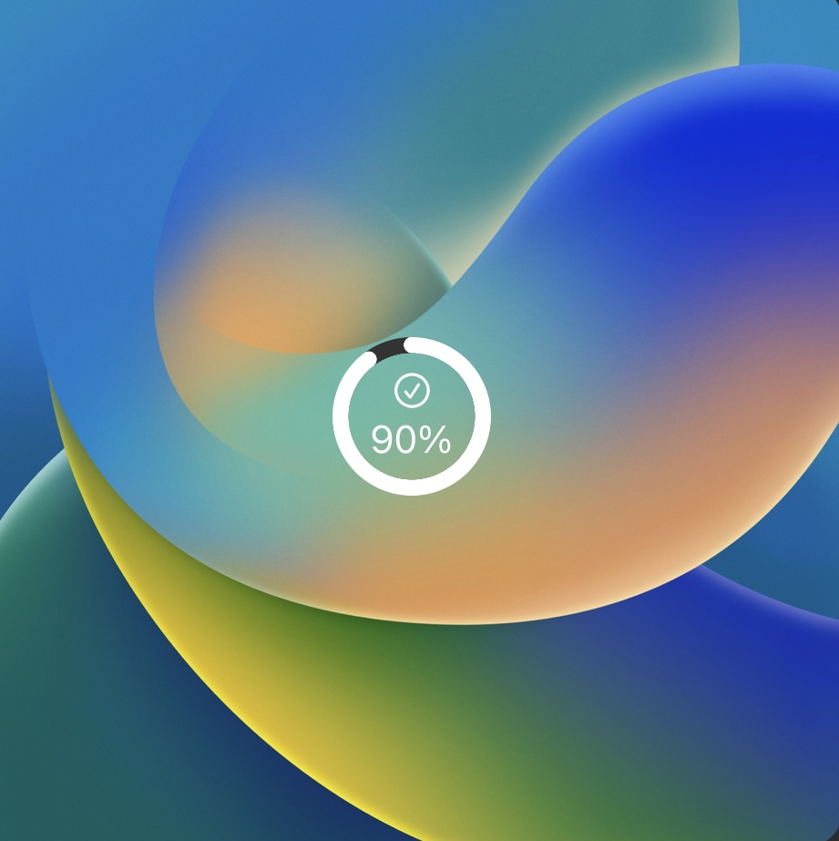

# Polestar SoC iOS Lockscreen Widget

An iOS lockscreen widget to display the current state of charge (SoC) of your Polestar.


## Background

Since the official Polestar App does not support any kind of widgets for iOS, I developed my own with the help of [Scriptable](https://scriptable.app/). It uses the official Polestar API which is also used to display the battery status in your profile at https://www.polestar.com.

## Prerequisites

1. Polestar Account login credentials which should work at https://polestarid.eu.polestar.com/PolestarLogin/ and VIN of your car.
2. Install [Scriptable](https://apps.apple.com/de/app/scriptable/id1405459188) on your iPhone
3. [Optional but recommended] Follow the [ScriptDude installation steps](https://scriptdu.de/#installation)

## Installation

1. Make sure you have followed all mandatory steps described in [Prerequisites](./README.md#Prerequisites).

2. There are two options to install the widget:
    - [Recommended] Click on the following button to install via `ScriptDude` (make sure that you have followed step 3 of [Prerequisites](./README.md#Prerequisites)). ScriptDude will automatically receive updates of new versions of this widget

        [](https://scriptdu.de/?name=Polestar%20Lockscreen%20SoC%20Widget&source=https%3A%2F%2Fgist.githubusercontent.com%2Fniklasvieth%2F9cb306b53835a9a283e34b77f0f2513f%2Fraw%2Ff5e29c99e8cc017c0d4fa2f8e825f79031282a2a%2Fpolestar-lockscreen-widget.js&docs=https%3A%2F%2Fgithub.com%2Fniklasvieth%2Fpolestar-ios-lockscreen-widget%2Fblob%2Fmain%2FREADME.md#generator&color=green&icon=battery-half)
    - Copy the content of [polestar-lockscreen-widget.js](https://gist.github.com/niklasvieth/9cb306b53835a9a283e34b77f0f2513f), create a new script in `Scriptable`, paste the content and rename it to `Polestar Lockscreen SoC Widget`.

3. Replace the placeholder values for `EMAIL_ADDRESS` and `PASSWORD` with your Polestar login credentials and provide your `VIN`.

    ```js
    // Config
    const POLESTAR_EMAIL = "EMAIL_ADDRESS";
    const POLESTAR_PASSWORD = "PASSWORD";
    const VIN = "VIN";
    ```

4. Add the smallest `Scriptable` widget to your lockscreen. See [Apple How-To guide](https://support.apple.com/en-us/HT207122#:~:text=How%20to%20add%20widgets%20to%20your%20Lock%20Screen).

5. Tab on the widget to configure the widget. Select `Polestar Lockscreen SoC Widget` as script, leave everything else blank and save your lockscreen.

6. You should now be able to see the :battery: SoC of your Polestar on you lockscreen. By clicking on the widget you will be navigated to the Polestar App.

## Additional comments

There might be a minor lag or difference of the SoC compared to value displayed in the Polestar App because of the following reason:

- The refresh interval of the widget is determined by iOS itself.

The icon has 4 different states.

1. Charging cable not connected. The polestar icon will be displayed.
2. Charging cable is connected, but car is currently not charging e.g. charging has not yet started or charging has been interrupted.

    

3. Charging cable is connected, car is currently charging.

    

4. Charging cable is connected, charging is done.

    

### Appreciation

- Thanks @simonbs for the awesome [Scriptable](https://scriptable.app/) app.
- Thanks @Sillium for the [ProgressCircleService.js](https://gist.github.com/Sillium/4210779bc2d759b494fa60ba4f464bd8#file-progresscircleservice-js) which I am reusing.

### Support me

<a href="https://www.paypal.me/niklasvieth" >
  
</a>